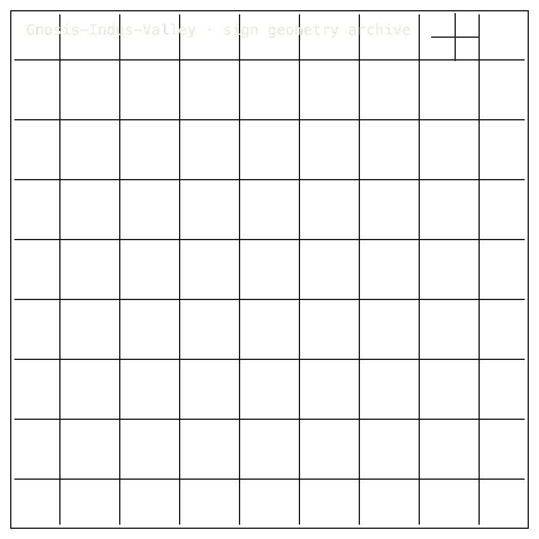

# Indus-Valley

## Install / Developer Commands

<!-- INSTALL-DX:START -->
#### Package Install

Installable package: `python3.11 -m pip install gnosis-indus`.
Current release: `0.1.0` on [PyPI](https://pypi.org/project/gnosis-indus/).
Source: [Zer0pa/Indus-Valley](https://github.com/Zer0pa/Indus-Valley/).

```bash
python3.11 -m pip install gnosis-indus
```

Import smoke:

```bash
python3.11 - <<'PY'
import importlib.metadata as md
import gnosis_indus

print("gnosis-indus", md.version("gnosis-indus"))
PY
```

Install success only proves package acquisition/import. Product scope, stale PyPI state, platform limits, and blockers remain in the front-door sections below.<!-- INSTALL-DX:END -->

#### Quick Start

Reproduce the Phase 02 stronger smoke path on any clean Python 3.11
host:

```bash
git clone https://github.com/Zer0pa/Indus-Valley.git gnosis-indus
cd gnosis-indus
python3.11 -m venv .venv && source .venv/bin/activate
pip install -e ".[test,numerics]"
pytest -q
```

Expected: `14 passed`. The pytest suite reproduces the authority-doc
query records from `authority/review_pack/search_demo_summary.md`
against the bundled `artifacts/phase4/indus_catalogue_demo_fixture.json`.
The fixture is small and authority-anchored; the real full catalogue
stays `FETCH_EXTERNAL` per `DATA_POLICY.md`. The Phase 4 stability
caveat (k=70 conditional) remains visible in the package and fixture
surfaces.

<table width="100%">
<tr>
<td width="100%" valign="top">
<div><span><b>00 · GNOSIS-INDUS-VALLEY</b> · NON-DECIPHERMENT SEARCH</span> <span>RESEARCH-READY · v0.1.0</span></div>
      <h1>Indus Script Search and <span>Computational Exploration</span></h1>
      <p>Gnosis Indus-Valley &middot; PyPI <em>gnosis-indus</em> v0.1.0 &middot; 412 signs &middot; 70 clusters &middot; github.com/Zer0pa/Indus-Valley</p>
      <p>The Indus script has gone unread for a century. Thousands of marks on seals, tablets, and tools &mdash; catalogued, contested, photographed &mdash; and no one knows what they say. What was missing was not more scholarship. It was a way to search the corpus by the <strong>shape</strong> of the marks, without claiming what they mean. <em>gnosis-indus</em> ships a clean-room <strong>412-sign / 70-cluster</strong> catalogue and answers shape queries in <strong>0.0451 ms</strong>. No glyph is read.</p>
</td>
</tr>
</table>

<table width="100%">
<tr>
<td width="100%" valign="top">
<figure>
        <div></div>
        <figcaption><b>Scope:</b> 412-sign clean-room catalogue and 70 shape clusters. Query speed is measured; no glyph is read.</figcaption>
      </figure>
</td>
</tr>
</table>

<table width="100%">
<tr>
<td width="100%" valign="top">
<div><b>01 · THE GAP</b> <span>A CENTURY WITHOUT SHAPE SEARCH</span></div>
      <h2>The Indus script has gone undecoded for a century; its marks were never searchable by <span>shape.</span></h2>
</td>
</tr>
</table>

<table width="100%">
<tr>
<td width="100%" valign="top">
<div><b>02 · MARKETS</b> <span>ADJACENT FORECASTS</span></div>
      <div>
        <div>
          <div><span>Cultural heritage digitization</span>  <span>'30 · $8.1B</span></div>
          <div><span>Research data management</span>  <span>'30 · $6.7B</span></div>
          <div><span>Scholarly infrastructure</span>  <span>'30 · $5.3B</span></div>
          <div><span>Digital humanities</span>  <span>'30 · $3.2B</span></div>
          <div><span>AI for archaeology</span>  <span>'30 · $1.4B</span></div>
        </div>
      </div>
      <div><em>source:</em> heritage and research-infrastructure forecasts. Best-fit users: epigraphy labs, museum archives, and digital-humanities groups. <strong>No traction or TAM claim.</strong></div>
</td>
</tr>
</table>

<table width="100%">
<tr>
<td width="50%" valign="top">
<div><b>03 · VALUE OF MARKET</b></div>
      <div><span>$8.1</span> <span>B</span></div>
      <div>Heritage digitization is funded. Tools that index this script by shape, without claiming to read it, remain <b>almost absent.</b></div>
</td>
<td width="50%" valign="top">
<div><b>04 · INSIGHT</b></div>
      <h2>The mark has a shape. The shape can be <span>searched.</span></h2>
</td>
</tr>
</table>

<table width="100%">
<tr>
<td width="50%" valign="top">
<div><b>05.1 · CURRENT TECH</b> <span>CATALOGUED, NOT SEARCHABLE BY FORM</span></div>
        <p>Indus scholarship lives in sign catalogues, visual classifications, and concordances. They let scholars compare marks one at a time, but no tool let them query the whole corpus by the shape of a single sign.</p>
</td>
<td width="50%" valign="top">
<div><b>05.2 · OUR TECH</b> <span>SEARCH BY SHAPE</span></div>
        <p><em>gnosis-indus</em> is a clean-room runtime: no neural model, no learned embedding, no substrate hypothesis. It bundles a conditional <strong>412-sign / 70-cluster</strong> catalogue and answers shape queries in <strong>0.0451 ms</strong>. The full <strong>179-inscription</strong> corpus stays fetch-external under data policy. No glyph is read; only the shape is found.</p>
</td>
</tr>
</table>

<table width="100%">
<tr>
<td width="100%" valign="top">
<div><b>05.3 · BENCHMARKS</b> <span>SEARCH TARGET + NMI</span></div>
      <div>
        <div>
          <div><span>Query latency</span><b>0.0451 ms</b><small></small></div>
          <div><span>target</span><b>100 ms</b><small></small></div>
          <div><span>NMI</span><b>0.5793</b><small>vs ICIT</small></div>
          <div><span>sigma</span><b>5.65</b><small></small></div>
        </div>
        <div>
          <div><span>Search</span>  <span>PASS</span></div>
          <div><span>NMI</span>  <span>PASS</span></div>
          <div><span>Substrate</span>  <span>OPEN</span></div>
        </div>
      </div>
      <div><b>Result:</b> demo shape search <strong>0.0451 ms</strong> vs <strong>100 ms</strong> target &middot; NMI <strong>0.5793</strong> vs ICIT Sets.</div>
</td>
</tr>
</table>

<table width="100%">
<tr>
<td width="34%" valign="top">
<div><b>06 · MEASUREMENT</b> <span>SEARCH TARGET · NMI · STRUCTURE</span></div>
      <h2>Shape search clears the latency target. Decipherment is not measured &mdash; <span>deliberately.</span></h2>
</td>
<td width="66%" valign="top">
<div><b>06.1 · COMPARATIVE PERFORMANCE · DEMO FIXTURE</b></div>
      <div>
        <div>
          <div><span>Max query</span>  <span>0.0451 ms</span></div>
          <div><span>target</span>  <span>100 ms</span></div>
          <div><span>under</span>  <span>~2,217&times;</span></div>
          <div><span>NMI</span>  <span>0.5793 sigma 5.65</span></div>
        </div>
      </div>
      <div>Demo shape search at <strong>0.0451 ms</strong> against a <strong>100 ms</strong> target &mdash; roughly <strong>2,217&times;</strong> under. Catalogue NMI <strong>0.5793</strong> vs ICIT Sets at sigma <strong>5.65</strong>. Phase 5 substrate question unresolved; <strong>no reading claimed.</strong></div>
</td>
</tr>
</table>

<table width="100%">
<tr>
<td width="100%" valign="top">
<div><b>07 · KEY METRICS</b> <span>MEASURED RESULTS</span></div>
</td>
</tr>
</table>

<table width="100%">
<tr>
<td width="100%" valign="top">
<div><b>07.1 · MAX QUERY LATENCY</b></div>
      <div>0.0451<span>ms</span></div>
      <div>Demo shape search &middot; <b>vs 100 ms target</b></div>
</td>
</tr>
</table>

<table width="100%">
<tr>
<td width="100%" valign="top">
<div><b>07.2 · CATALOGUE NMI</b></div>
      <div>0.5793</div>
      <div>vs ICIT Sets &middot; <b>sigma 5.65</b></div>
</td>
</tr>
</table>

<table width="100%">
<tr>
<td width="100%" valign="top">
<div><b>07.3 · PHASE 5 VERDICT</b></div>
      <div>STRUCT</div>
      <div>Linguistic structure confirmed &middot; <b>substrate unresolved</b></div>
</td>
</tr>
</table>

<table width="100%">
<tr>
<td width="100%" valign="top">
<div><b>07.4 · PYPI RELEASE</b></div>
      <div>0.1.0</div>
      <div>PyPI <em>gnosis-indus</em> &middot; <b>public, reproducible</b></div>
</td>
</tr>
</table>

<table width="100%">
<tr>
<td width="100%" valign="top">
<div><b>07.5 · CATALOGUE SCOPE</b></div>
      <div>412<span>signs</span></div>
      <div>70 clusters &middot; <b>179 inscriptions; full corpus fetched separately</b></div>
</td>
</tr>
</table>

<table width="100%">
<tr>
<td width="100%" valign="top">
<div><b>08 · DETERMINISM</b> <span>SEARCH THAT REPLAYS</span></div>
      <h2>Same query. Same fixture. Same matches &mdash; <span>across replay clones.</span></h2>
</td>
</tr>
</table>

<table width="100%">
<tr>
<td width="66%" valign="top">
<div><b>08.1 · WHAT REPLAYS EXACTLY</b> <span>DEMO SEARCH SURFACE</span></div>
      <p>The runtime is clean-room &mdash; no neural model, no learned embeddings, no substrate guess. The same shape query against the bundled fixture returns the same matches across replay clones, every time, anchored to the same source records.</p>
      <p>The catalogue is conditional on Phase 4 stability, and the Phase 5 source-structure question is unresolved. Determinism covers shape search, not interpretation. No glyph is read, and the runtime is built so it cannot quietly start to.</p>
</td>
<td width="34%" valign="top">
<div><b>08.2 · HONEST BLOCKER</b></div>
      <span>Honest Blocker &middot;</span>
      <p><strong>No reading claimed.</strong> The Phase 5 source-structure question is <em>unresolved</em>: we do not know what language, if any, the script encodes. Sign images stay policy-limited under <code>DATA_POLICY.md</code>. The bundled fixture is small; the full <strong>412 / 70 / 179</strong> catalogue is fetched separately.</p>
</td>
</tr>
</table>

<table width="100%">
<tr>
<td width="33%" valign="top">
<div><b>09</b> </div>
      <h2>SEARCH THAT REFUSES TO <span>READ.</span></h2>
</td>
<td width="67%" valign="top">
<div><b>09.1 · THE AMBITION</b></div>
      <p>The ambition is computational restraint. <em>gnosis-indus</em> gives Indus scholarship a search surface, a cluster map, and a comparison primitive &mdash; and stops there. The refusal to read is not a hedge. It is the product. A catalogue researchers and museums can trust because it never overreaches into translation.</p>
</td>
</tr>
</table>

<table width="100%">
<tr>
<td width="33%" valign="top">
<div><b>09.2 · WHAT WORKS NOW</b></div>
        <h2>Shape search runs in 0.0451 ms, NMI confirms cluster structure, and the catalogue stays free of reading.</h2>
</td>
<td width="67%" valign="top">
<div><b>09.3 · WHAT'S STILL OPEN</b></div>
        <h2>Substrate question unresolved, image policy limited, catalogue conditional, and full corpus stays fetch-external for now.</h2>
</td>
</tr>
</table>

<table width="100%">
<tr>
<td width="100%" valign="top">
<div><b>09.4</b> &middot; SCHOLARSHIP · NEAR-TERM (12&ndash;24 MO)</div>
      <div>Indus scholars can search by shape</div><div>A paleographer who notices a familiar mark on a newly photographed seal can find every visually related sign across the corpus in milliseconds. The conversation moves from "have I seen this before" to "here are the seventeen places it appears."</div>
</td>
</tr>
</table>

<table width="100%">
<tr>
<td width="100%" valign="top">
<div><b>09.5</b> &middot; DEBATE · NEAR-TERM (12&ndash;24 MO)</div>
      <div>Decipherment debate gets cleaner footing</div><div>Comparisons among signs and clusters can stay anchored to structure, not to translation guesses. Researchers arguing competing theories share the same shape-grounded reference instead of talking past each other about disputed readings.</div>
</td>
</tr>
</table>

<table width="100%">
<tr>
<td width="100%" valign="top">
<div><b>09.6</b> &middot; MUSEUMS · MID-TERM (24&ndash;48 MO)</div>
      <div>Museum catalogues gain a structural index</div><div>Curators can attach sign-family and cluster labels to seal records alongside images. Visitors and remote researchers query holdings by mark shape, and discovery surfaces stop depending on a translation no museum is willing to assert.</div>
</td>
</tr>
</table>

<table width="100%">
<tr>
<td width="100%" valign="top">
<div><b>09.7</b> &middot; METHOD · MID-TERM (24&ndash;48 MO)</div>
      <div>Shape search becomes shared infrastructure</div><div>The same primitive &mdash; search by form, refuse to read &mdash; generalises to other undeciphered scripts: Linear A, Proto-Elamite, Rongorongo. Shape-first analysis becomes a shared method, and labs stop rebuilding the same catalogue plumbing from scratch.</div>
</td>
</tr>
</table>

<table width="100%">
<tr>
<td width="100%" valign="top">
<div><b>09.8</b> &middot; DISCIPLINE · PARADIGM (48 MO+)</div>
      <div>Honest non-claim becomes a scientific asset</div><div>In contested heritage, a maintained refusal to overclaim outlasts every dramatic weak claim. The Indus catalogue stands as the durable object: a corpus researchers, curators, and the public can trust precisely because it never said what the signs mean.</div>
</td>
</tr>
</table>
